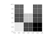
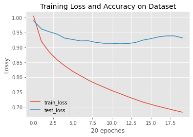

Image Classification & Semantic Segmentation
=================================================================

Sahba Bostanbakhsh

Part 1: Image Classification {#image-classification}
----------------------------

### Overview

In order to classify the Fasion-mnist dataset with good accuracy we need
a good model architecture!! the one example could be as simple as this :

-   INPUT -\> [CONV2D -\> RELU -\> MaxPool] -\> [CONV2D -\> RELU -\>
    MaxPool] -\> FC -\> RELU -\> FC -\> OUTPUT

For this model, cross-entropy loss is used for computing the loss, Adam
is used for optimization, and the model was trined over 10 epoches, the
total accuracy is about 91% to 92%.

After training and validating the model the loss/Accuracy vs \#samples
can be plotted.

From the plot above we can see some overfitting has occurred. This could
happen because of many reasons. For example, if we have alot of
parameters for training.

However we can reduce overfitting by improving our model or tunning the
hyperparameters.

### Results {#Results}

the modle prediction chart: .

the hardes class to classify is shirt! and the reason could be the
information gain from the pixels share same hyperparameters as other
classes:

The shirt class had the lowest accuracy for both the validation and test
set.

lets look at some correct (Green) and incorrect (Red) predictions done
by our model.

  

   

  

  

  

  

  

   

  

   

### Filters

Below, the 3x3 filters have been visualized.

  
  
 

  
  
 

  
  
 

  
  
 

Semantic Segmentation {#Semantic-Segmentation}
---------------------

### Overview

This part of the project is a bit harder to implement since it requires
downsampling and upsampling of an input image.

### Architecture

The layers used are below:

-   Conv2d(3,32, 3, stride=1, padding=1)
-   BatchNorm2d(32)
-   ReLU
-   MaxPool2d(2)
-   Conv2d(32,64, 3,stride=1, padding=1)
-   BatchNorm2d(32)
-   ReLU
-   MaxPool2d(2)
-   Conv2d(64,64,3, stride=1, padding=1)
-   BatchNorm2d(64)
-   ReLU
-   nn.ConvTranspose2d(64,64,2,stride=2, padding=0)
-   Conv2d(64,32,3, stride=1, padding=1)
-   BatchNorm2d(32)
-   ReLU
-   ConvTranspose2d(32, 32, 2, stride=2, padding=0)
-   Conv2d(32,self.n\_class, 3, stride=1, padding=1)

### Train Loss and Test Loss plot {#Train Loss and Test Loss plot}

The graph below shows the modle is overfitting.

### AP: average-precision {#AP: average-precision}

The reported values for the average precision of the network are below.

    AP = 0.5432155628391006
    AP = 0.6932388379961033
    AP = 0.1567090498345968
    AP = 0.8025611932893545
    AP = 0.3401661294507566

### Results {#Results}

The sample image below illustrates how the net would classify the parts
in an image.

 

 

### What class does model classify correctly and incorrectly {#What class does model classify correctly and incorrectly:}

Model is good for classifing windows. Facade and others score better
than avrage but pillar and balcony have low AP score. Model is not good
to classify pillar and balcony
